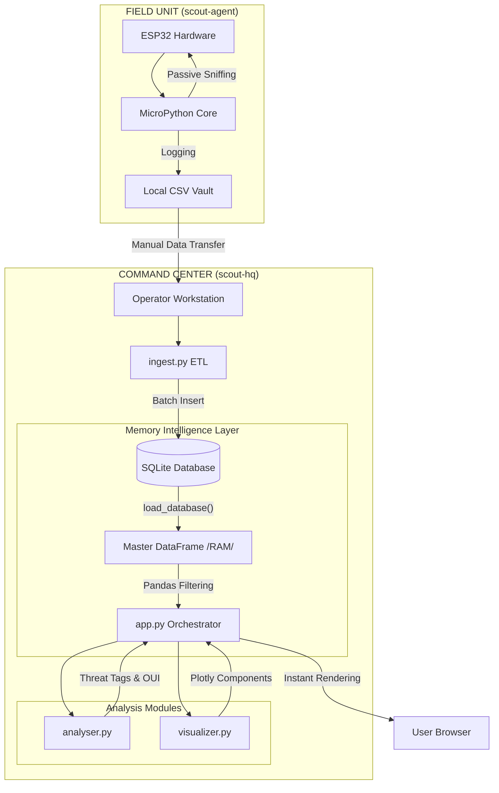

# Silent-Scout

### **By George Freedom**
A dual-component surveillance system designed for radio frequency reconnaissance, combining an **ESP32 Edge Agent** with a sophisticated **Streamlit Command Center (HQ)**.

This project demonstrates a complete **Hardware-to-Intelligence pipeline**: capturing raw 802.11 signals in the field, managing a local data vault, and performing tactical analysis to identify security risks and infrastructure patterns.

It serves as a professional blueprint for **IoT & Data Engineering**, of an embedded hardware sensing and high-level analytical visualization using a modern, AI-augmented workflow.

### ⚙️ Core System Capabilities:
It demonstrates key engineering concepts including:

* **Edge Intelligence (Hardware):** Deploying a passive reconnaissance agent using MicroPython on ESP32 to sniff, filter, and log WiFi environments without network association.

* **Data Vault & Ingestion (ETL):** A robust process for transferring "field logs" (CSV) into a centralized SQLite database, ensuring data integrity and historical persistence.

* **Tactical Analysis Engine:** The core processing logic. Translating raw MAC addresses into vendor identities (OUI) and assigning risk tags based on signal patterns.

* **Visual Reconnaissance:** An interactive Streamlit dashboard featuring custom CSS, tactical legends, and Plotly charts for signal distribution and channel occupation analysis.

* **System Architecture:** A modular "Agent-HQ" design, separating low-level hardware constraints from high-level data science and visualization.

---

## 🚀 Key Features
* **Stealth Reconnaissance:** The ESP32 Agent operates in passive mode, logging SSIDs, BSSIDs, and RSSI levels without leaving a digital footprint.

* **Mission-Based Tracking:** Organize data by Locality IDs and Timestamps, allowing for comparative analysis of the same location over time.

* **Automated Threat Tagging:** Intelligent identification of mobile hotspots, surveillance infrastructure (CCTV), and hidden networks.

* **RSSI Proximity Grading:** Visual color-coding of signal strength to estimate physical distance to targets (Near/Medium/Far).

* **RF Environment Profiling:** Detailed breakdown of channel occupation to identify network congestion or potential interference.

* **Hardware Interface:** Real-time visual feedback on the Agent via LED signaling for successful scans and system readiness.

---

## 🏗️ Project Architecture
The system follows a decoupled architecture. The Agent is optimized for reliability and power efficiency in the field, while the HQ is designed for deep data exploration and tactical decision-making.

### System Diagram



## File Structure

```
silent-scout/
│
├── scout-agent/                # 🛰️ Field Unit Firmware (MicroPython)
│   ├── main.py                 # Agent entry point & operation loop
│   └── scout/                  # Core Agent package
│       ├── __init__.py         # Module exposure
│       ├── hardware.py         # LED, Button, and Radio drivers
│       └── logic.py            # Scanning and CSV logging logic
│
├── scout-hq/                   # 📡 Command Center (Streamlit)
│   ├── app.py                  # Dashboard Orchestrator
│   ├── config.py               # Global paths and project identity
│   ├── ingest.py               # ETL: CSV to SQLite transfer
│   ├── assets/                 # UI Styling (Custom CSS)
│   ├── data/                   # Storage (Database & Static JSONs)
│   └── modules/                # Analytical & Visual components
│       ├── __init__.py
│       ├── db_manager.py       # SQLite operations & indexing
│       ├── analyser.py         # Tactical analysis & OUI lookup
│       └── visualizer.py       # UI rendering & Plotly charts
│
└── README.md                   # This file
```

## 💡 Development Philosophy & AI Collaboration
This project was built using a **"Human-Architect, AI-Builder"** methodology.

The process involved:

* **Human-led Strategy:** Defining the tactical scope (WiFi reconnaissance), hardware-software split, and the "Silent Scout" brand identity. Establishing the data schema for cross-platform compatibility.

* **AI-assisted Engineering:** Using AI to optimize the ESP32's non-blocking hardware loops and refactor the HQ modules for professional Python standards (Type Hints, Row Factory, Indexing).

* **AI-augmented Analysis:** Leveraging AI to generate extensive OUI vendor databases and prototype complex Plotly visualizations for the RF channel occupation charts.

## ⚙️ Setup and running
Unlike standard web apps, **Silent Scout** requires a coordinated setup between hardware and software.


**Phase 1: Field Unit (Agent)**
* **Hardware:** An ESP32 development board.

* **Firmware:** Flash MicroPython (v1.20+) to the device.

* **Deployment:** Use Thonny or mpremote to upload the contents of the scout-agent/ folder to the ESP32.

* **Operation:** Power the device. Use the onboard button to trigger a "Tri-Scan". Data is saved to a csv file.

**Phase 2: Command Center (HQ)**
1. **Environment:** Create a virtual environment and install dependencies:
```bash
python -m venv venv
    # On Windows: venv\Scripts\activate
    # On macOS/Linux: source venv/bin/activate

pip install -r requirements.txt
```

2. **Clone the Repository:**
    ```bash
    git clone https://github.com/GeorgeFreedomTech/silent-scout.git
    cd silent-scout
    ```

3. **Data Ingest:** Place your csv file from the Agent into data/inbox/ and run:
```bash
python ingest.py
```

4. **Launch Dashboard:**
```bash
streamlit run app.py
```

## 🔗 Let's Connect:

* Visit my website: **[https://GeorgeFreedom.com](https://GeorgeFreedom.com)**
* Connect on LinkedIn: **[https://www.linkedin.com/in/georgefreedom/](https://www.linkedin.com/in/georgefreedom/)**
* Let's talk: **[https://cal.com/georgefreedom](https://cal.com/georgefreedom)**


## 📜 License:

Copyright (c) 2025 Jiří Svoboda (George Freedom) / George Freedom Tech

This project is licensed under:
* Creative Commons Attribution-NonCommercial-ShareAlike 4.0 International License

---

We build for the Future!
