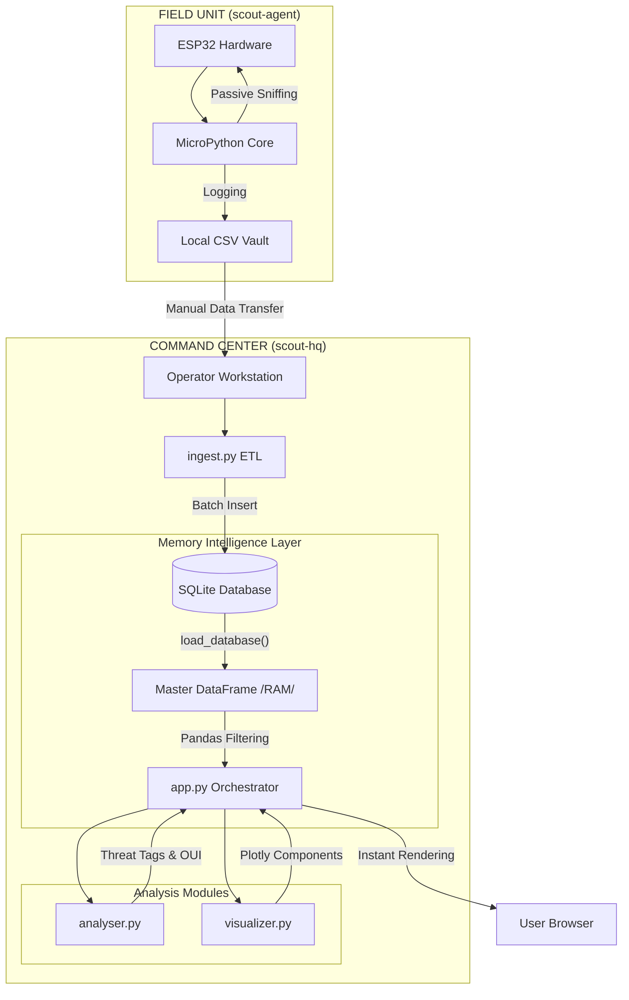

# Silent Scout

### **By George Freedom**
Silent Scout is a low-profile, passive WiFi reconnaissance system designed for **Digital Resilience and Field Situational Awareness**.

Born from a philosophy of Tactical Minimalism, it rejects "fragile efficiency" and automated cloud dependencies. Instead, it focuses on a decoupled "Agent-HQ" architecture: an expendable, disconnected field sensor (Agent) and a centralized analytical dashboard (HQ).

This project is a practical application of **Cyber-EDC** principles—building tools that are simple, transparent, and resilient by design.

Full Story: https://georgefreedom.com/the-silent-scout-minimalism-as-a-weapon-of-digital-resilience/


## 🚀 Key Features
* **Passive Edge Reconnaissance:** Operating in "Dead Metal" mode, the sniffer captures 802.11 signals without network association or credential storage. This ensures a zero-footprint operation with no digital signature left behind.

* **Air-Gapped Data Pipeline:** A deliberate manual ingest workflow eliminates the need for automated cloud syncing (Flask/REST). By removing the most common remote vulnerability points, the system ensures a secure, physical chain of custody for all field data.

* **Tactical Expendability:** Optimized for $5 ESP32 microcontrollers. In the event of hardware loss or compromise, your primary infrastructure and network credentials remain completely isolated and secure.

* **Absolute Control:** No "smart" automation or hidden background processes. The operator maintains total manual control over the data flow from sensing in the field to intelligence analysis at HQ.


## ⚙️ System Architecture
The system follows a decoupled architecture. The Agent is optimized for reliability and power efficiency in the field, while the HQ is designed for deep data exploration and tactical decision-making.

### 📡 Edge Agent (The Sensor)
A lightweight MicroPython-based sniffer running on ESP32, engineered for high-stakes data collection.

* **Field-Ready Build:** Designed to be powered by Li-Po batteries, protected by heat-shrink casing, and operated via a single tactile button.

* **Passive Sniffing:** Captures 802.11 beacon frames silently without active transmission, ensuring maximum stealth during reconnaissance.

### 💻 Intelligence HQ (The Base)
A sophisticated Python and Streamlit-powered dashboard for instantaneous post-processing and tactical visualization.

* **Single-load RAM Cache:** A high-performance strategy that moves the entire SQLite vault into memory upon launch for lag-free data exploration.

* **Threat Tagging Engine:** Automatically identifies surveillance infrastructure (CCTV), mobile hotspots, and hidden networks through OUI mapping and heuristic analysis.

* **RSSI Proximity Grading:** Translates raw decibel values into actionable distance tiers (Near/Medium/Far), allowing operators to prioritize targets based on physical proximity.


### System Diagram



## File Structure

```
silent-scout/
│
├── scout-agent/                # 🛰️ Field Unit Firmware (MicroPython)
│   ├── main.py                 # Agent entry point & operation loop
│   └── scout/                  # Core Agent package
│       ├── __init__.py         # Module exposure
│       ├── hardware.py         # LED, Button, and Radio drivers
│       └── logic.py            # Scanning and CSV logging logic
│
├── scout-hq/                   # 📡 Command Center (Streamlit)
│   ├── app.py                  # Dashboard Orchestrator
│   ├── config.py               # Global paths and project identity
│   ├── ingest.py               # ETL: CSV to SQLite transfer
│   ├── assets/                 # UI Styling (Custom CSS)
│   ├── data/                   # Storage (Database & Static JSONs)
│   └── modules/                # Analytical & Visual components
│       ├── __init__.py
│       ├── utils.py            # Core logic for data loading, caching, and common I/O helpers
│       ├── db_manager.py       # SQLite operations & indexing
│       ├── analyser.py         # Tactical analysis & OUI lookup
│       └── visualizer.py       # UI rendering & Plotly charts
│
├── requirements.txt            # Python dependencies
├── .gitignore                  # Files ignored by Git
└── README.md                   # This file
```

## 💡 Development Philosophy & AI Collaboration
This project was built using a **"Human-Architect, AI-Builder"** methodology.

The process involved:

* **Human-led Strategy:** Defining the tactical scope (WiFi reconnaissance), hardware-software split, and the "Silent Scout" brand identity. Establishing the data schema for cross-platform compatibility.

* **AI-assisted Engineering:** Using AI to optimize the ESP32's non-blocking hardware loops and refactor the HQ modules for professional Python standards (Type Hints, Row Factory, Indexing).

* **AI-augmented Analysis:** Leveraging AI to generate extensive OUI vendor databases and prototype complex Plotly visualizations for the RF channel occupation charts.

## ⚙️ Setup and running
Unlike standard web apps, **Silent Scout** requires a coordinated setup between hardware and software.

**Phase 1: Environment & Repository**
Before deploying to hardware, prepare your local workstation:
1.1. Clone the Repository:
```bash
git clone https://github.com/GeorgeFreedomTech/silent-scout.git
cd silent-scout
```

1.2. Set Up Python Environment:
```bash
python -m venv venv
    # On Windows: venv\Scripts\activate
    # On macOS/Linux: source venv/bin/activate

pip install -r requirements.txt
```

**Phase 2: Field Unit Deployment (Agent)**
Deploy the reconnaissance firmware to your ESP32:

* **Hardware:** Any ESP32 development board.

* **Firmware:** Ensure MicroPython (v1.20+) is flashed to the device.

* **Upload:** Use Thonny or mpremote to upload the entire contents of the scout-agent/ folder to the ESP32 root.

* **Operation:** Power the device. Use the onboard BOOT button to trigger a scan. Results are logged to scout_vault.csv on the device's flash memory.

**Phase 3: Intelligence Processing (HQ)**

3. **Data Ingest:**
Transfer and analyze the captured data:

3.1. Data Ingest: Copy csv from the ESP32 to scout-hq/data/inbox/ and run the ETL script:
```bash
python ingest.py
```
This populates the SQLite database with your field observations.

3.2 **Launch Dashboard:**
Start the command center to visualize the results:
```bash
streamlit run app.py
```

## 🔗 Let's Connect:

* Visit my website: **[https://GeorgeFreedom.com](https://GeorgeFreedom.com)**
* Connect on LinkedIn: **[https://www.linkedin.com/in/georgefreedom/](https://www.linkedin.com/in/georgefreedom/)**
* Let's talk: **[https://cal.com/georgefreedom](https://cal.com/georgefreedom)**


## 📜 License:

Copyright (c) 2025 Jiří Svoboda (George Freedom) / George Freedom Tech

This project is licensed under:
* Creative Commons Attribution-NonCommercial-ShareAlike 4.0 International License

---

We build for the Future!
